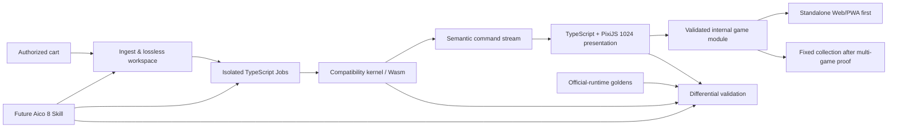

# Aico 8

Aico 8 is an end-to-end system for turning legally supplied PICO-8 cartridges
into modern, high-fidelity 1024×1024 game remakes while preserving original game
logic, timing, input feel, memory behavior, music, and sound effects. It ships one
statically bound standalone Web game first, then may assemble several independently
validated internal game modules into a fixed collection.

This is larger than a single AI Skill. Aico 8 is the toolchain and runtime; a
future Skill will be a thin intelligent entry point that invokes its tested
commands, evaluates results, and requests human review where artistic or legal
judgment is required.

Aico 8 is TypeScript-first: the Web/PWA, 1024 presentation, mobile shell,
product CLI, asset pipeline, and validation UI use TypeScript. The current
prototype has a narrow C++ compatibility kernel; a gated Rust replacement spike
must prove native, browser, and ESP32-P4 delivery before the language decision
changes. See [ADR 0001](docs/decisions/0001-language-boundary.md) and the
[proposed ADR 0002](docs/decisions/0002-rust-kernel-spike.md).

> Status: early research and executable runtime prototype. Do not use it to
> redistribute cartridges without permission from their authors and contributors.

For AI development, start at [AGENTS.md](AGENTS.md). Product wording, current
status, contracts, evidence, tests, and open work follow the ownership rules in
[the governance policy](docs/GOVERNANCE.md); README is not a status ledger.

## Why 1024×1024 is the reference target

PICO-8 keeps its authoritative simulation at 128×128 logical units. Aico 8's
default HD profile renders to 1024×1024 without changing those coordinates:

- one logical unit is exactly 8×8 output pixels;
- one common 8×8 PICO tile becomes exactly 64×64 HD pixels;
- sixteen tiles span exactly 1024 pixels;
- collision, timing, map access, and replay data stay in original coordinates;
- modern art, vector UI, particles, lighting, and accessibility run at 1024-native quality.

The diagnostic compatibility path scales the original 128×128 framebuffer by
exactly 8×, filling the same 1024×1024 surface with no fractional source pixels.
720×720 remains a supported delivery profile derived from the reference target.

## System shape



## Repository areas

| Area | Responsibility |
| --- | --- |
| `tools/` | Research cart tools being migrated behind the TypeScript product CLI. |
| `pipeline/` | Contracts for ingest, analysis, remake planning, asset production, validation, and release. |
| `runtime/core/` | Narrow portable compatibility kernel prototype: memory, scheduler, input, VM, reference raster/audio, and semantic stream. |
| `runtime/third_party/` | Pinned and audited third-party runtime components. |
| `apps/web/` | TypeScript/PixiJS 1024×1024 presentation bootstrap and future PWA host. |
| `apps/mobile/` | Planned Capacitor iOS/Android packaging and lifecycle adapter. |
| `platform/esp32/` | Planned ESP-IDF/ESP32-P4 host and renderer. |
| `specs/` | Machine-readable and human-readable cross-layer contracts. |
| `tests/` | Official semantic probes, secondary runtime captures, and deterministic replay definitions. |
| `research/` | Evidence, technical decisions, compatibility gaps, and representative-cart findings. |
| `skills/` | Future thin orchestration layer; deliberately not created as the runtime itself. |

Internal game modules are versioned build inputs, not a public cartridge format.
The `.aico8`/general Player decision is deferred until at least three materially
different games prove compatibility, migration, security, and product demand.

## Status and evidence

Machine-linked current status is in `governance/project.json`. Research claims,
private corpus results, official/secondary captures, implementation paths, and
test selectors are distinguished there so implementation is not mistaken for
verified acceptance. Private carts and the bulk corpus remain excluded.

## Quick start

Build and run the public core tests:

```sh
make -C runtime/core test
```

Create a private lossless workspace from an authorized cart:

```sh
mkdir -p private/workspaces
python3 tools/p8_workbench.py unpack /path/to/game.p8.png private/workspaces/game
```

Private representative-cart adapters, replays, and evidence live in the private
research archive. They consume the same public contracts but are never required
by public CI.

See [the architecture](docs/ARCHITECTURE.md),
[product requirements](docs/PRODUCT.md), [cross-layer contracts](docs/CONTRACTS.md),
[1024 display contract](specs/display-1024.md), and [roadmap](ROADMAP.md).

## Content and licensing policy

Aico 8 does not grant rights to a cartridge or its assets. Ingested carts,
extracted workspaces, official-runtime captures, and generated remakes are
private by default. Publication is a separate release gate requiring verified
permission, attribution, and compatible dependency notices.

Aico 8 project source is licensed under [Apache-2.0](LICENSE). Third-party files
retain their own notices under `runtime/third_party/`. This license does not
grant rights to PICO-8, any cartridge, or a generated remake.

Dust Bunny is a private compatibility research and testing target only. No cart
content or formal remake release is distributed without the rights holder's
permission.
